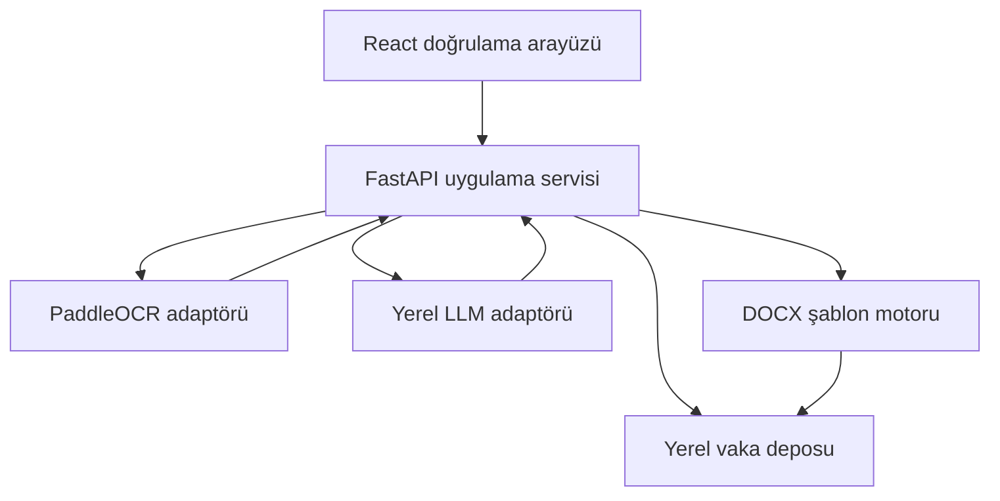

# Mimari ve veri akışı

## İlk iterasyonun uygulama durumu

İlk dikey dilimlerde React/Vite istemcisi ile FastAPI uygulama servisi; yerel yükleme, PDF sayfalaştırma, PaddleOCR 3.x adaptörü, kaynaklı kural tabanlı çıkarım, tekli/toplu kullanıcı onayı, manuel sayfa döndürme/kırpma, yerel Qwen3-8B destekli taslak kaydı ve kurumsal DOCX taslağı uygulanmıştır. Sayfa düzeltmesi türetilmiş yerel görüntü üretir; özgün dosyayı değiştirmez ve OCR/çıkarımı yeniden çalıştırmak üzere geçersizleştirir. Qwen yalnızca kullanıcı onaylı alanlarla şemalı bölüm planı oluşturur; sunucu planı doğruladıktan sonra olgusal metni sabit kurallarla üretir. DOCX katmanı, boş asıl `.doc` belgesinden yerelde türetilen v2 `.docx` ile JSON eşlemesinin yer tutucularını bire bir doğrular. SAYI yalnızca manuel girdidir ve kullanıcı onayı olmadan Word dosyası oluşturulmaz.

Uygulanan veri sözleşmesi `schemas/case-extraction.schema.json` dosyasıdır. Alanlar; normalize değerinin yanında özgün değer, aday çelişkiler ve poligonlu kaynak bilgisini de tutar. Ayrıntılar [ilk iterasyon kaydında](iteration-01.md) bulunur.

## Önerilen bileşenler



## İşleme hattı

1. **Alım:** Dosya imzası, boyut, sayfa sayısı ve güvenli dosya adı kontrol edilir.
2. **Sayfalaştırma:** PDF sayfaları kayıpsız/uygun DPI görüntülere dönüştürülür.
3. **Ön işleme:** Yön, perspektif ve gerekirse kontrast varyantları üretilir.
4. **OCR:** Metin, güven, poligon ve okuma sırası kanonik modele dönüştürülür.
5. **Belge türü:** Kurallarla aday üretilir; belirsizse kullanıcı seçer.
6. **Alan çıkarımı:** Önce regex ve konumsal kurallar, sonra gerekirse yerel LLM.
7. **Birleştirme:** Aynı alanın kaynakları karşılaştırılır; çelişkiler korunur.
8. **İnsan onayı:** Kritik alanlar kullanıcı tarafından doğrulanır.
9. **Taslak:** Yalnızca onaylı alanlarla Qwen'den şemalı bölüm planı alınır; plan doğrulandıktan sonra taslak JSON/TXT olarak yerelde kaydedilir.
10. **DOCX:** Kullanıcı kaynaklı kritik alanları onayladıktan sonra manuel SAYI, rapor tarihi, muayene tarih-saati, anamnez ve güncel muayene bulgularını yerelde girer. Sunucu, v2 şablon/JSON eşleme sözleşmesini doğrular, boş asıl şablondan türetilen `.docx` çalışma kopyasını `docxtpl` ile doldurur, çözülmemiş yer tutucuyu reddeder ve dosyayı vaka içinde ezmeden saklar. Kaynak veya Word girdisi değişirse eski taslak `superseded` olur ve indirilemez.

## Servis sınırları

OCR ve LLM kitaplıklarını iş mantığından ayır:

- `OCRProvider.read(page) -> list[OCRLine]`
- `LLMProvider.extract(context, schema) -> StructuredExtraction`
- `ReportRenderer.render(approved_case, template) -> ReportArtifact`

Bu arayüzler model/kütüphane yükseltmelerini alan kurallarından izole eder ve LLM kapalı testleri mümkün kılar.

## Docker OCR çalışma zamanı

`compose.yaml`, API'yi yalnızca `web` servisi arkasında tutar; ana makineye açılan tek port `127.0.0.1:5173`'tür. API'nin PaddleOCR 3.1.0 adaptörü, imajdaki sabit Türkçe algılama ve Latin alfabe tanıma modellerinin mutlak yollarıyla başlatılır. Docker build, model katmanını oluştururken ağ erişimi kullanır; container çalışırken `PADDLE_PDX_DISABLE_MODEL_SOURCE_CHECK=True` ve açık model klasörleri sayesinde uzaktan model kaynağı aranmaz.

`backend/scripts/verify_paddle_ocr.py`; salt sentetik Türkçe üst yazı rasterında gerçek motorun en az bir metin satırı ve dört köşeli kanıt poligonları ürettiğini denetler. Test, OCR metnini çıktıya yazmaz.

Qwen3-8B ağırlıkları `qwen3-8b/` altında tutulur ve Docker imajı bağlamından hariçtir. `compose.yaml` bu klasörü API'ye `/models/qwen3-8b:ro` olarak bağlar; `HF_HUB_OFFLINE` ve `TRANSFORMERS_OFFLINE` çalışma anı dış ağ erişimini kapatır. Model, ilk taslak isteğinde 4-bit GPU belleğine yüklenir; model/GPU erişilemezse taslak isteği hata verir ve başka sağlayıcıya geçmez.

## Saklama önerisi

Her vaka için tahmin edilemeyen bir kimlik kullan. Dosya sistemi düzeni kullanıcı dosya adından türetilmemelidir:

```text
data/cases/<case-id>/
  originals/
  pages/
  derived/
  reports/
```

Veri tabanı yalnızca yolları ve meta verileri tutar. Üretim kurulumu; disk şifreleme, erişim kontrolü, yedekleme ve saklama/silme politikasını kurum kararıyla tamamlar.

## Neden MongoDB şart değil?

Vaka, belge, alan kaynağı, kullanıcı düzeltmesi ve denetim kaydı ilişkisel ve işlem bütünlüğü gerektiren verilerdir. Tek makinede SQLite daha az operasyon yükü getirir. Kurumsal eşzamanlı kullanımda PostgreSQL'e geçiş öngörülebilir. MongoDB ancak ekipte bağlayıcı bir MERN standardı varsa seçilmelidir.
